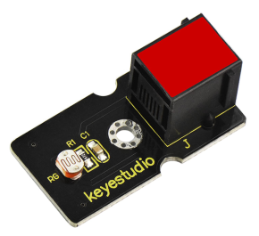
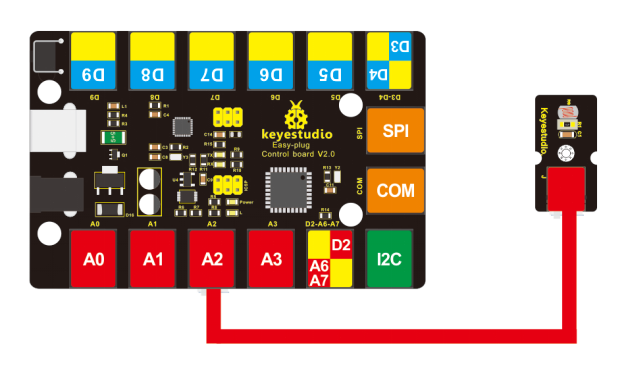
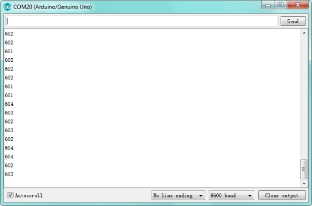

# KS0106 keyestudio EASY plug Photocell Sensor



## 1. Introduction

A photoresistor or light-dependent resistor (LDR) or photocell is a light-controlled variable resistor. The principal is very simple.

The resistance of photoresistor varies with incident light intensity. If the incident light intensity is high, the resistance decreases; if the light intensity is low, the resistance increases.

Keyestudio EASY Plug photocell sensor is a semiconductor, integrated with a photoresistor, easy to use and very convenient for wiring.

It has features of high sensitivity, quick response, spectral characteristic and R-value consistence.

It can be applied in light-sensitive detector circuits, intelligent switch design and light- and dark-activated switching circuits.

This module should be used together with EASY plug control board.

**Special Note:**

The sensor/module is equipped with the RJ11 6P6C interface, compatible with our keyestudio EASY plug Control Board with RJ11 6P6C interface.

If you have the control board of other brands, it is also equipped with the RJ11 6P6C interface but has different internal line sequence, can’t be used compatibly with our sensor/module.

## 2. Specification

- Interface: Easy plug
- Sensor type: analog
- Working voltage: 5V
- Quick response

## 3. Technical Details

- Dimensions: 38mm * 20mm * 18mm
- Weight: 4.3g

## 4. Connect It Up

Connect the EASY Plug photocell sensor to control board using an RJ11 cable. Then connect the control board to your PC with a USB cable.



## 5. Upload the Code

Download code:   [Code](./Code.7z)

```c
int sensorPin =A2 ;
int value = 0;

void setup()
{
	Serial.begin(9600); 
}

void loop()
{
    value = analogRead(sensorPin);
    Serial.println(value, DEC);
    delay(50);
}
```

## 6. Result

Done uploading the code, you should see the analog value change in accordance with how much light your photoresistor is sensing. 

